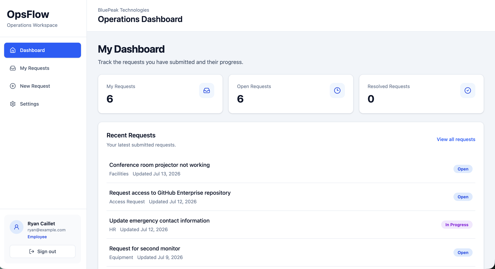
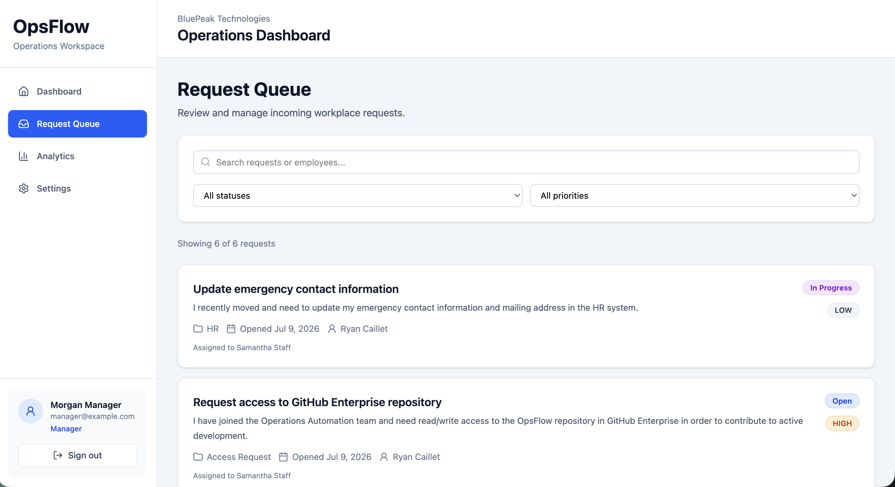
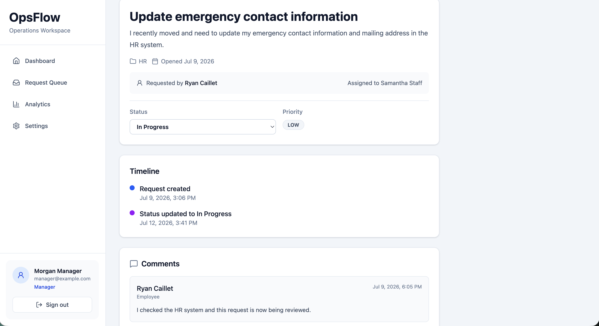
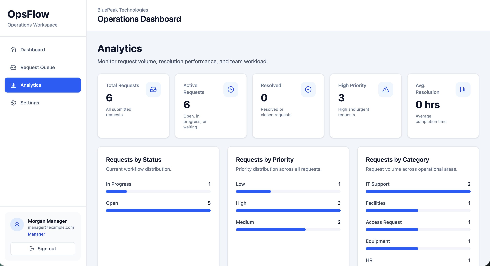
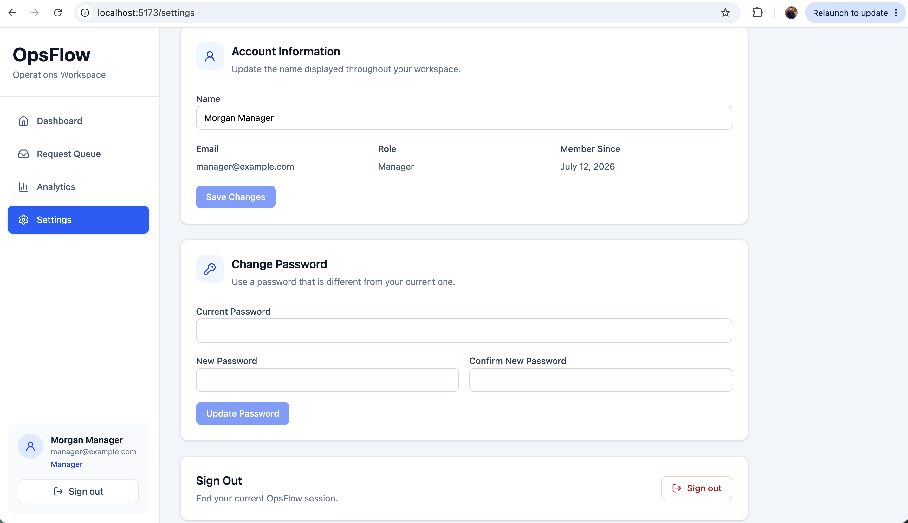

<div align="center">

# OpsFlow

### Modern Internal Operations Management Platform

A full-stack operations management platform built with **React, TypeScript, Express, PostgreSQL, and Prisma** that streamlines workplace requests through secure authentication, role-based access control, analytics, and an intuitive user experience.

<br>


<br>

🚀 **Live Demo:** Coming Soon

💻 **Source Code:** https://github.com/rycaillet/opsflow

</div>

---



---

# Overview

OpsFlow is a full-stack operations management platform designed to help organizations manage internal workplace requests in one centralized system.

Employees can submit requests for IT support, facilities, equipment, HR, and other operational needs. Staff members review, assign, update, and resolve requests, while managers gain visibility into workload, request trends, and operational performance through built-in analytics.

The application was designed with real-world software engineering practices in mind, including secure authentication, role-based authorization, RESTful APIs, responsive design, and a clean separation between frontend and backend services.

---

# The Problem

Many organizations still manage internal requests through email, spreadsheets, chat applications, or disconnected ticketing systems.

This creates several challenges:

- Requests become difficult to track.
- Ownership is often unclear.
- Employees lack visibility into request progress.
- Managers have limited insight into operational workload.
- Reporting and analytics require manual effort.

---

# The Solution

OpsFlow centralizes internal operations requests into a single application where users can:

- Submit workplace requests
- Track request progress
- Assign ownership
- Collaborate through comments
- Monitor operational performance
- Analyze workload across the organization

The result is a cleaner workflow, improved visibility, and better accountability for everyone involved.

---

# Key Features

## 🔐 Authentication & Security

- JWT-based authentication
- Secure password hashing with bcrypt
- Protected frontend routes
- Backend authorization middleware
- Persistent login sessions
- Profile management
- Password updates

---

## 👥 Role-Based Access Control (RBAC)

OpsFlow supports three user roles.

### Employee

- Create requests
- View personal requests
- Track request status
- Participate in request discussions
- Update account settings

### Staff

Everything available to Employees, plus:

- View the organization request queue
- Assign requests
- Update request status
- Manage operational workload

### Manager

Everything available to Staff, plus:

- Organization-wide analytics
- Team workload reporting
- Operational dashboards
- Request trend analysis

Authorization is enforced on both the frontend and backend to ensure users can only access functionality appropriate for their role.

---

## 📋 Request Management

- Create workplace requests
- Request priorities
- Request categories
- Status workflow
- Assignment support
- Comments
- Resolution tracking
- Search and filtering
- Responsive request queue

---

## 📊 Analytics Dashboard

Managers have access to operational metrics including:

- Total requests
- Active requests
- High priority requests
- Resolution statistics
- Request breakdown by status
- Request breakdown by priority
- Request breakdown by category
- Team workload

---

## ⚙️ Account Management

Users can:

- Update profile information
- Change passwords
- View account details
- Securely sign out

---

# Technology Stack

| Layer | Technology |
|--------|------------|
| Frontend | React 19 |
| Language | TypeScript |
| Build Tool | Vite |
| Styling | Tailwind CSS |
| Icons | Lucide React |
| Routing | React Router |
| Backend | Node.js + Express |
| Database | PostgreSQL |
| ORM | Prisma |
| Authentication | JWT + bcrypt |
| API Style | REST |
| Deployment | Vercel + Render + Neon PostgreSQL |

---

# Project Highlights

This project demonstrates experience with:

- Full-stack application architecture
- REST API design
- Database modeling with Prisma
- PostgreSQL
- Authentication & Authorization
- Role-Based Access Control
- Responsive UI development
- Component-driven React architecture
- State management with React Context
- Type-safe frontend/backend development
- Professional Git workflow using feature branches and incremental commits

---

# System Architecture

```text
                    React 19 + TypeScript
                             │
                    React Router + Context
                             │
                     REST API (HTTPS)
                             │
                  Express + TypeScript API
                             │
                    Authentication (JWT)
                             │
                        Prisma ORM
                             │
                        PostgreSQL
```

OpsFlow follows a modern client-server architecture that separates presentation, business logic, and data persistence.

- **Frontend** provides a responsive user interface built with React and TypeScript.
- **Backend** exposes a secure REST API responsible for authentication, authorization, validation, and business logic.
- **Prisma ORM** provides a type-safe interface between the application and PostgreSQL.
- **JWT authentication** secures every protected API request while enabling stateless authentication.
- **Role-Based Access Control (RBAC)** is enforced on both the frontend and backend to ensure users only access features appropriate for their role.

---

# Application Screenshots

## Dashboard

The dashboard provides users with an overview of request activity, key metrics, and recently updated requests.


---

## Request Queue

Staff and managers can search, filter, assign, and manage requests from a centralized queue.



---

## Request Details

Each request includes status tracking, assignment information, comments, priority, requester details, and a complete activity timeline.



---

## Analytics Dashboard

Managers gain visibility into operational performance through request metrics, workload reporting, and category breakdowns.



---

## Account Settings

Users can securely update profile information, change passwords, and manage their account.



---

# Demo Accounts

OpsFlow includes seeded demo accounts for each permission level.

| Role | Email | Password |
|------|-------|----------|
| Employee | `ryan@example.com` | `Password123!` |
| Staff | `staff@example.com` | `Password123!` |
| Manager | `manager@example.com` | `Password123!` |

These accounts allow reviewers to experience the application from different perspectives without creating additional users.

---

# Project Structure

```text
opsflow/
│
├── backend/
│   ├── prisma/
│   ├── src/
│   │   ├── config/
│   │   ├── controllers/
│   │   ├── middleware/
│   │   ├── routes/
│   │   ├── services/
│   │   └── types/
│   │
│   └── package.json
│
├── frontend/
│   ├── src/
│   │   ├── components/
│   │   ├── context/
│   │   ├── hooks/
│   │   ├── pages/
│   │   ├── routes/
│   │   ├── services/
│   │   └── types/
│   │
│   └── package.json
│
├── docs/
│   ├── product-requirements.md
│   ├── system-architecture.md
│   └── ui-plan.md
│
├── screenshots/
│   ├── dashboard.png
│   ├── request-queue.png
│   ├── request-detail.png
│   ├── analytics.png
│   └── settings.png
│
├── README.md
└── .gitignore
```

---

# Running Locally

## 1. Clone the repository

```bash
git clone https://github.com/rycaillet/opsflow.git

cd opsflow
```

---

## 2. Backend Setup

```bash
cd backend

npm install
```

Create a `.env` file:

```env
PORT=5001
NODE_ENV=development
CLIENT_URL=http://localhost:5173

DATABASE_URL=your_database_url

JWT_SECRET=your_secret_key

JWT_EXPIRES_IN=7d
```

Run the database migrations:

```bash
npx prisma migrate dev
```

Seed the database:

```bash
npm run prisma:seed
```

Start the backend:

```bash
npm run dev
```

---

## 3. Frontend Setup

```bash
cd frontend

npm install
```

Create a `.env` file:

```env
VITE_API_BASE_URL=http://localhost:5001/api
```

Start the frontend:

```bash
npm run dev
```

---

# Environment Variables

## Backend

| Variable | Description |
|----------|-------------|
| `PORT` | Express server port |
| `NODE_ENV` | Runtime environment |
| `CLIENT_URL` | Frontend URL |
| `DATABASE_URL` | PostgreSQL connection string |
| `JWT_SECRET` | Secret used to sign JWT tokens |
| `JWT_EXPIRES_IN` | Authentication token lifetime |

---

## Frontend

| Variable | Description |
|----------|-------------|
| `VITE_API_BASE_URL` | Base URL for the backend API |

---

# Engineering Decisions

One of the primary goals of OpsFlow was to build an application using patterns and technologies commonly found in modern production software. Rather than simply implementing features, the project emphasizes maintainability, scalability, and security.

---

## JWT Authentication

OpsFlow uses JSON Web Tokens (JWT) for authentication instead of traditional server-side sessions.

### Why?

- Stateless authentication simplifies backend architecture.
- APIs can be scaled without maintaining server session state.
- Tokens are sent with each authenticated request.
- Protected routes can validate users independently.

JWT is a common authentication strategy used in modern REST APIs and cloud-native applications.

---

## Role-Based Access Control (RBAC)

The application supports three user roles:

- Employee
- Staff
- Manager

Permissions are enforced in **both the frontend and backend**.

The frontend adapts the user interface based on the authenticated user's role, while the backend independently validates every protected request to prevent unauthorized access.

This layered approach ensures that security does not rely solely on the client.

---

## REST API Architecture

The backend exposes a RESTful API built with Express.

Responsibilities are separated into:

- Routes
- Controllers
- Services
- Middleware

This structure keeps routing, business logic, and authentication concerns independent, making the application easier to maintain as it grows.

---

## Prisma ORM

Prisma was selected as the ORM because it provides:

- End-to-end type safety
- Excellent TypeScript integration
- Database migrations
- Simplified querying
- Automatic model generation

Using Prisma significantly reduces boilerplate while improving developer productivity and reducing runtime errors.

---

## PostgreSQL

PostgreSQL serves as the primary relational database.

A relational database was chosen because workplace requests naturally contain structured relationships such as:

- Users
- Requests
- Comments
- Assignments

These relationships are efficiently modeled using foreign keys and relational queries.

---

## React Context for Authentication

Authentication state is managed using React Context.

This allows every page to access the authenticated user without repeatedly passing props through multiple component levels.

The result is a cleaner and more maintainable component architecture.

---

## Component-Driven UI

The frontend was intentionally designed using reusable UI components.

Examples include:

- Button
- Card
- Input
- Layout components

This approach improves consistency while reducing duplicated code throughout the application.

---

## Responsive Design

OpsFlow was designed to provide a consistent experience across desktop and mobile devices.

Layouts adapt using responsive Tailwind CSS utilities while preserving usability for each role.

---

## Feature Branch Workflow

Development followed a feature branch workflow similar to professional software teams.

Major features were developed independently before being merged into the main branch.

Examples include:

- Authentication
- RBAC Foundation
- Settings Page
- UI Polish

Each milestone was committed separately to create a clean and understandable Git history.

---

# Lessons Learned

Building OpsFlow provided practical experience with modern full-stack software engineering, including:

- Designing REST APIs
- Implementing secure authentication
- Enforcing authorization using RBAC
- Modeling relational databases
- Working with Prisma ORM
- Building reusable React components
- Managing application state
- Structuring scalable backend services
- Creating responsive user interfaces
- Organizing development using feature branches and incremental commits
- Preparing applications for production deployment

---

# Future Improvements

Potential enhancements include:

- File attachments for requests
- Email notifications
- Real-time updates using WebSockets
- Audit logging
- Advanced search and filtering
- Docker containerization
- Automated testing
- CI/CD pipelines
- Request templates
- SLA tracking and reporting

---

# License

This project is licensed under the MIT License.

---

# Author

**Ryan Caillet**

Computer Science student at George Mason University with a passion for building modern full-stack applications.

If you'd like to connect or discuss this project, feel free to reach out through LinkedIn or GitHub.

---

Thank you for taking the time to review OpsFlow.

Feedback and suggestions are always welcome.